<div align="center">
  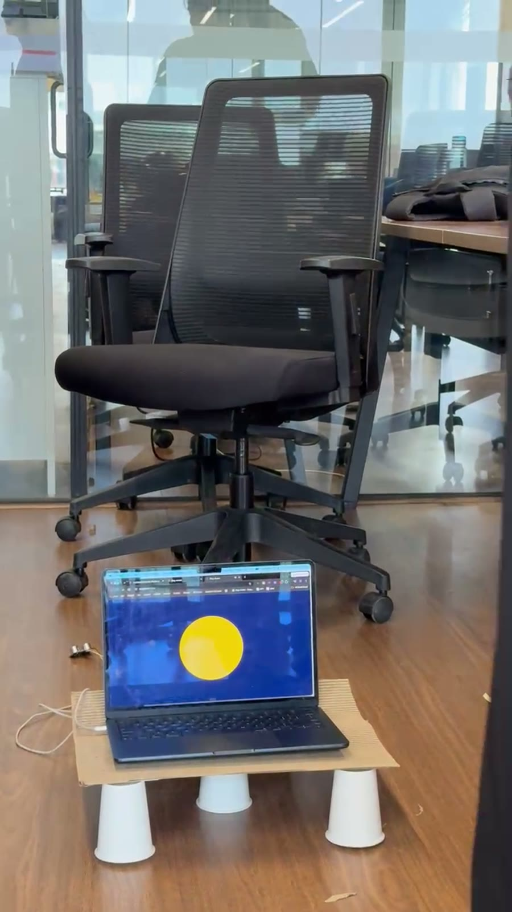
  <h1>Dogify</h1>
  <p><b>Be there for your dog, from anywhere.</b></p>
  <a href="https://saiswrp7.github.io/dogify/"></a>
  <a href="https://saiswrp7.github.io/dogify/media/dogify_demo.mp4"></a>
  
  <p><a href="#why">Why</a> · <a href="#see-it-work">Demo</a> · <a href="#photos">Photos</a> · <a href="#new-capability">New capability</a> · <a href="#how-it-works">How it works</a> · <a href="#run-it">Run it</a> · <a href="#rubric-map">Rubric map</a></p>
</div>

## Why

Ravi dances all day and his dog Pablo waits at the door. **Pablo panics within minutes, and Ravi only finds out at night.** Dogify tells Ravi the moment Pablo is struggling, and lets him answer with his own voice, a video, a treat, or Pablo's ball. Ravi stops cancelling plans, and Pablo stops waiting alone.

## See it work

**The problem:** a dog left alone gets anxious fast, and the owner can't see it or help.

<a href="https://saiswrp7.github.io/dogify/media/dogify_demo.mp4"></a>

<div align="center"><a href="https://saiswrp7.github.io/dogify/"></a></div>

**What just happened**
1. **Input:** the camera takes 3 photos of Pablo a few seconds apart, and the mic hears barking. Ravi can also ask the Telegram bot "show me my dog".
2. **What Claude did:** it read Pablo's body language across the frames and returned a mood, a confidence and a one-line reason as strict JSON, in the form `{"state": "anxious", "confidence": 0.8, "why": "..."}`.
3. **Result:** Ravi asked the bot "show me my dog" and got the photo with Pablo's mood. He sent a 🎤 voice note, and it played on Pablo's screen with his face. Then a treat, only once Pablo was calm.

## Photos

> [!IMPORTANT]
> Photos needed: **handwritten note**. Add it to `./assets/` and attach it to the GitHub Release for this submission.

<table>
  <tr>
    <td align="center"><br><sub>Finished build</sub></td>
    <td align="center">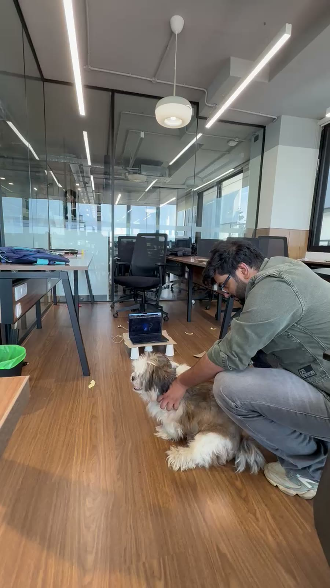<br><sub>Us with the build</sub></td>
    <td align="center">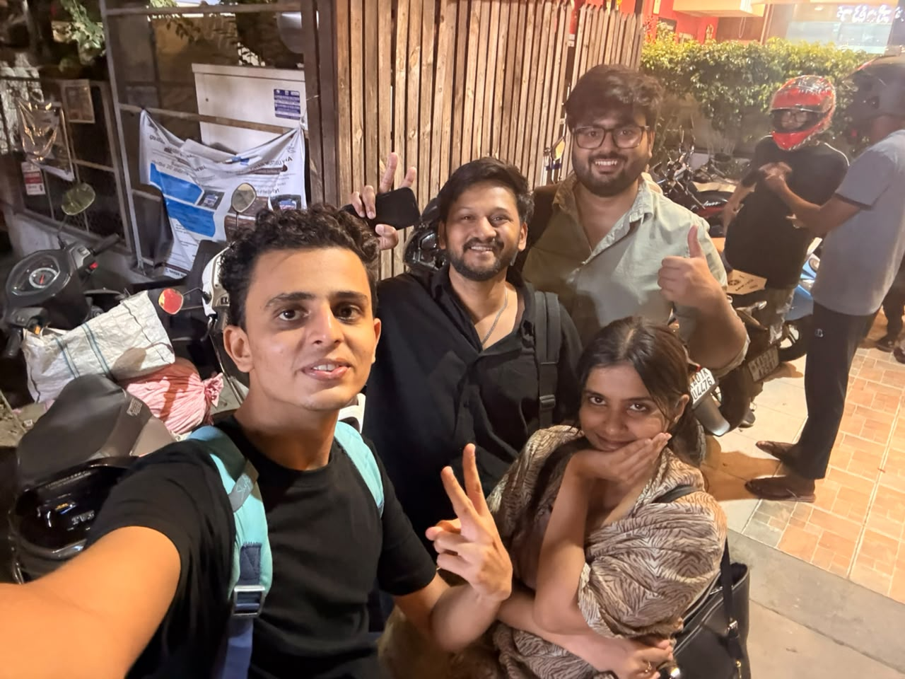<br><sub>Team Sober Hathi</sub></td>
  </tr>
  <tr>
    <td align="center">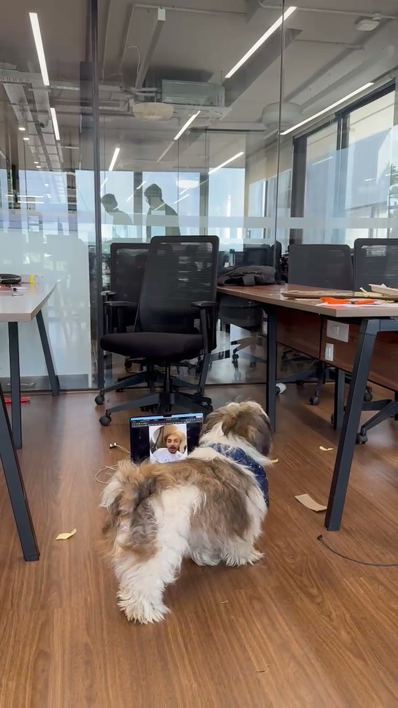<br><sub>Pablo meets the owner's video</sub></td>
    <td align="center">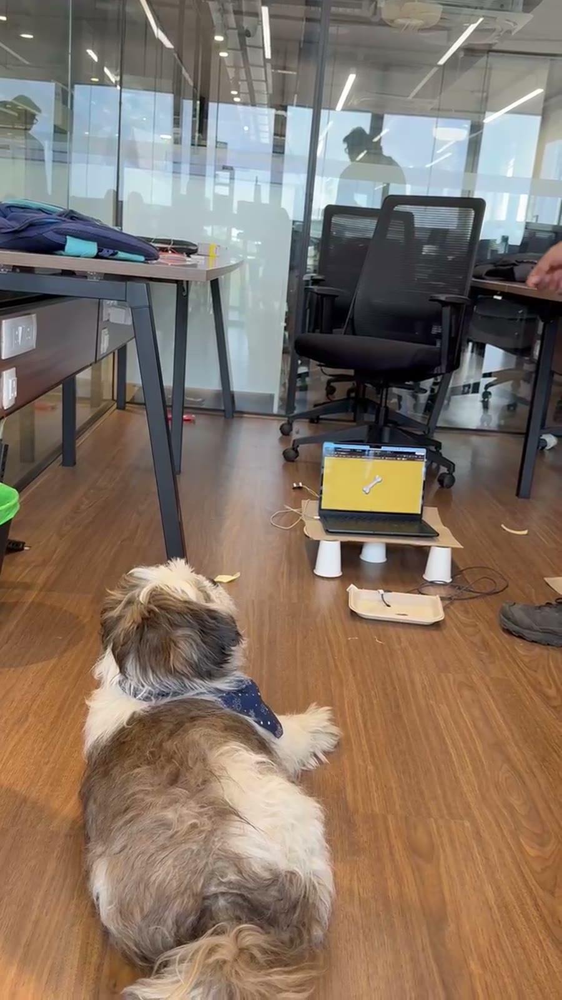<br><sub>Pablo watches the treat scene</sub></td>
    <td align="center">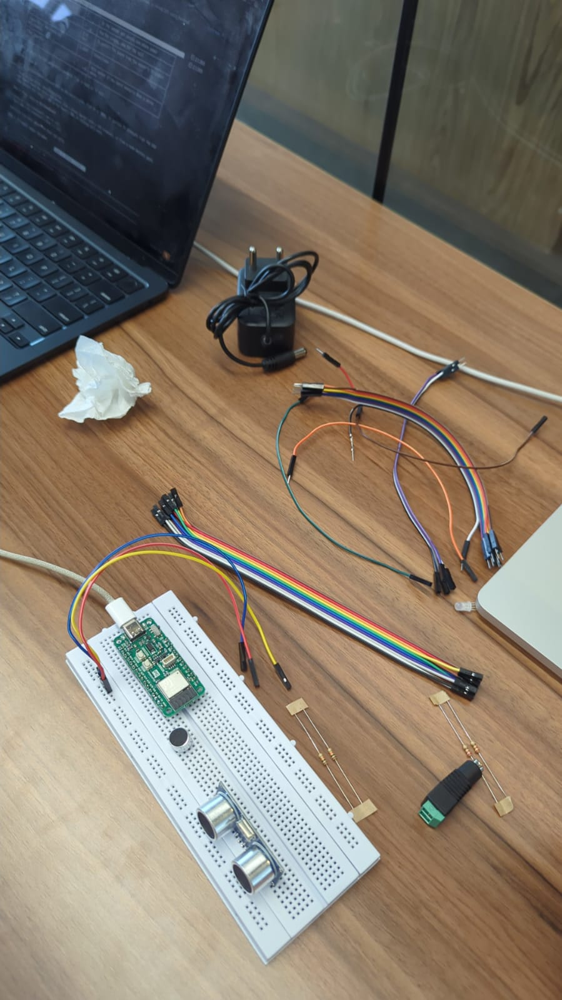<br><sub>Close-up: ESP32 + ultrasonic sensor</sub></td>
  </tr>
  <tr>
    <td align="center"><br><sub>UI: voice scene</sub></td>
    <td align="center">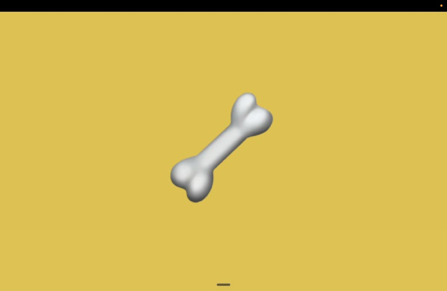<br><sub>UI: treat scene</sub></td>
    <td align="center">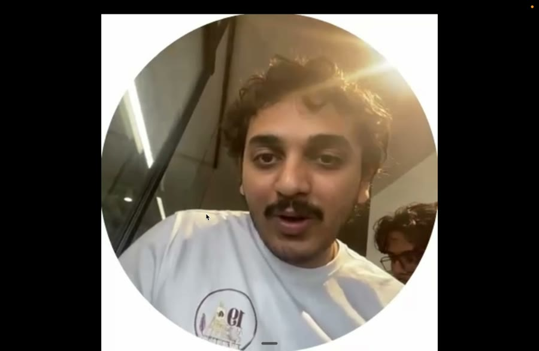<br><sub>UI: owner's video note</sub></td>
  </tr>
  <tr>
    <td align="center">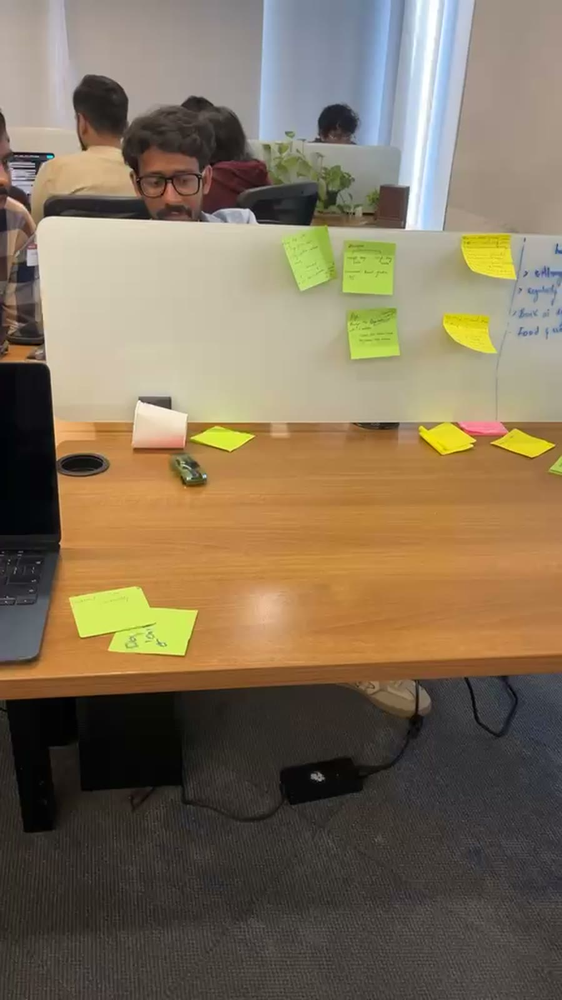<br><sub>Behind the scenes: planning</sub></td>
    <td align="center">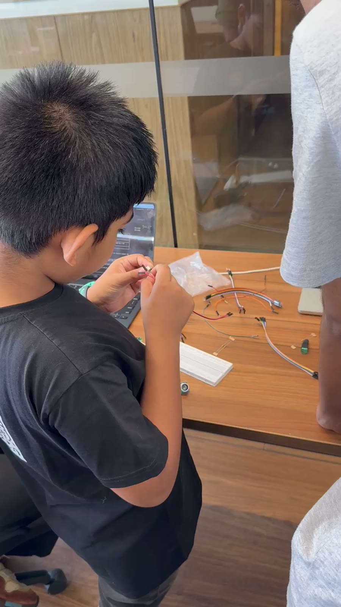<br><sub>Behind the scenes: wiring</sub></td>
    <td align="center"><sub><b>Photo needed:</b> handwritten note</sub></td>
  </tr>
</table>

## New capability

**Vision on messy, real-world camera frames, returned as guaranteed-valid JSON.** Claude reads a dog's body language from 3 phone-camera photos taken seconds apart (pacing vs resting, ears, tail), plus the mic's loudness. It answers in a strict schema (`calm | anxious | lonely | sleeping | playing | not_visible`, a confidence, and a one-line reason), so the code can act on it without parsing guesswork.

| | Previous model | Claude Haiku 4.5 (this build) |
|---|---|---|
| Reading motion across 3 frames | TODO: not tested | Tells pacing from resting by comparing frames |
| Output format | TODO: not tested | Schema-enforced JSON (structured outputs), no retries |
| Cost per look | TODO | about $0.003, which is ~$0.50 to $1 a day, capped at $20 |

> [!NOTE]
> We have not yet run the older model on the same frames. The honest before/after test is `brain/label_test.py`: run it with both model ids on the same labelled frames. Until then these cells stay TODO.

**Where it happens in the code**
- Mood from frames: [`brain/classify.py#L59`](./brain/classify.py#L59) (the call itself at [L83](./brain/classify.py#L83), strict JSON at [L88](./brain/classify.py#L88))
- Owner's report, written by Claude Sonnet 5: [`owner/report.py#L50`](./owner/report.py#L50)
- "Show me my dog" on Telegram: [`owner/ask_bot.py#L193`](./owner/ask_bot.py#L193)

## How it works

A laptop camera watches Pablo. When he barks, comes close to the box, or every 5 minutes, Claude reads his mood. Ravi controls everything from Telegram, and a dog-facing screen and an ESP32 box carry it out.

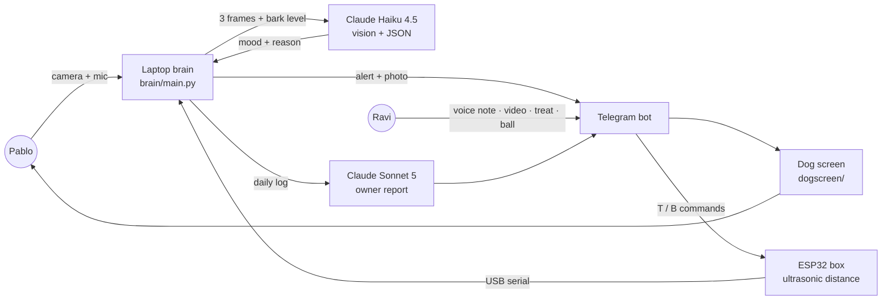

| Layer | Tool | Why |
|---|---|---|
| Eyes and ears | Laptop webcam (OpenCV), mic (sounddevice) | Hardware we already had |
| Mood reading | Claude Haiku 4.5, vision + structured outputs | Fast and cheap enough to look every 5 minutes |
| Owner report | Claude Sonnet 5 | Writes a warm summary from computed stats, never invents numbers |
| Owner app | Telegram bot (`owner/ask_bot.py`) | Nothing to install; voice notes and video built in |
| Dog side | Full-screen web page (`dogscreen/`), blue and yellow only | Dogs see blue and yellow best |
| The box | ESP32-C6 (PCB Cupid Glyph C6) + HC-SR04 ultrasonic | Knows when the dog is close |
| Safety | `budget.py` hard $20 cap on Claude spend | A prototype can't run up a bill |

## Run it

**Works live**
- Camera + Claude mood reading, every 5 minutes or on a bark
- Telegram: "show me my dog" (photo, mood, distance), voice notes played live, owner video on the dog screen, typed commands
- Dog screen with its sounds (chime, crinkle, squeaks)
- Ultrasonic distance from the ESP32 box
- $20 spend cap; `./start.sh` keeps it all running
- 17 automated tests pass (`pytest brain/tests owner/tests`: the calming ladder, report stats, Telegram command routing)

**Mocked or not built yet**
- Treat and ball: a teammate drops the treat and rolls the ball by hand when the chime plays (no servos yet)
- The Telegram panel in the demo video is recreated; the real bot has the same buttons
- Reports on request (today, 7 days, all time) are not built
- The brain can still act on its own; an owner-only "alert mode" is next

```bash
git clone https://github.com/Saiswrp7/dogify && cd dogify
python3 -m venv .venv && .venv/bin/pip install -r requirements.txt
cp owner/.env.example owner/.env      # then fill it in
./start.sh                            # dog screen + Telegram bot + brain; ./stop.sh to stop
```

| Env var (`owner/.env`) | What it is |
|---|---|
| `ANTHROPIC_API_KEY` | Your Claude API key |
| `DOG_BOT_TOKEN` | Telegram bot token from @BotFather |
| `DOG_CHAT_ID` | Your Telegram chat id (`python -m owner.get_chat_id`) |
| `DOG_NAME` | Your dog's name |
| `DOG_BUDGET_USD` | Claude spend cap, default 20 |

<details><summary>Flash the ESP32 box</summary>

```bash
arduino-cli compile --upload -p /dev/cu.usbmodem101 --fqbn esp32:esp32:Pcbcupid_GLYPH_C6:CDCOnBoot=cdc dog_box
```
Pins: Trig GPIO 4, Echo GPIO 5 (through a 1k/2k divider), treat servo D6, ball servo D7. More in [`docs/BUILD_NOTES.md`](./docs/BUILD_NOTES.md).
</details>

**Hosted link live until: 2026-10-27**

## Team

<table>
  <tr>
    <td align="center"><br><b>Sai</b><br><sub>TODO: role</sub></td>
    <td align="center"><sub>TODO: teammate<br>name, role, GitHub</sub></td>
    <td align="center"><sub>TODO: teammate<br>name, role, GitHub</sub></td>
  </tr>
</table>

## Rubric map

| Criterion | Evidence | Proof |
|---|---|---|
| New Capability | Claude vision reads dog body language across frames and returns strict JSON | [New capability](#new-capability) |
| It Works | Live site, demo video, photos of the real build with Pablo, honest status list | [See it work](#see-it-work) · [Photos](#photos) · [Run it](#run-it) |
| Keep or Share | Every working owner with a dog, every workday | [Why](#why) |
| Clarity of Demo | One-line problem, GIF on the first screen, input → Claude → result | [See it work](#see-it-work) |

<sub>Research behind the problem: 15+ papers, listed in [`deck/research.md`](./deck/research.md). Pitch deck: [live](https://saiswrp7.github.io/dogify/deck/) · [PPT](./deck/Dogify_SoberHathi.pptx) · [PDF](./deck/Dogify_SoberHathi.pdf).</sub>
