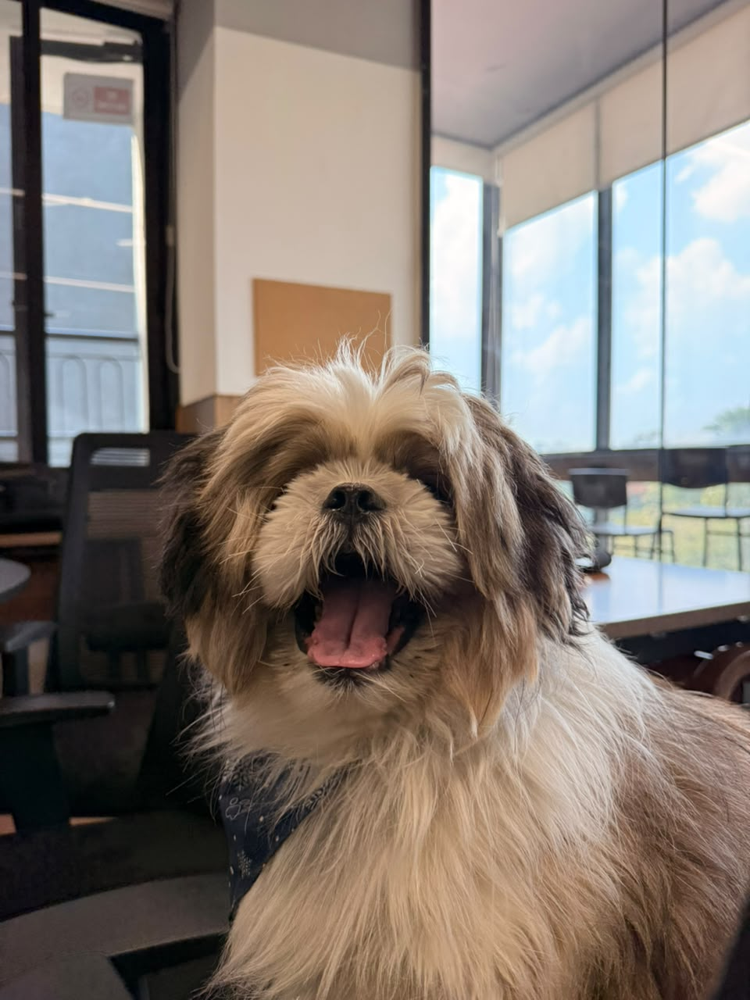

  
  <h1>Dogify</h1>
  
<b>Be there for your dog, from anywhere.</b>

  
  
  

> [!NOTE]
> Work in progress. The source code (camera brain, Telegram bot, dog screen, ESP32 box) and the full README are being added next.

## What's here
| | |
|---|---|
| [Live site](https://saiswrp7.github.io/dogify/) | Demo video, deck, downloads |
| [`deck/`](./deck/) | Pitch deck (open `index.html`), PowerPoint, PDF, and [research sources](./deck/research.md) |
| [`video/`](./video/) | The 67 s demo video as a Remotion project (`npm install && npm run render`) |
| [`media/dogify_demo.mp4`](./media/dogify_demo.mp4) | Web copy of the demo video |

Team Sober Hathi · almost as wild as a drunken elephant, just sober.
